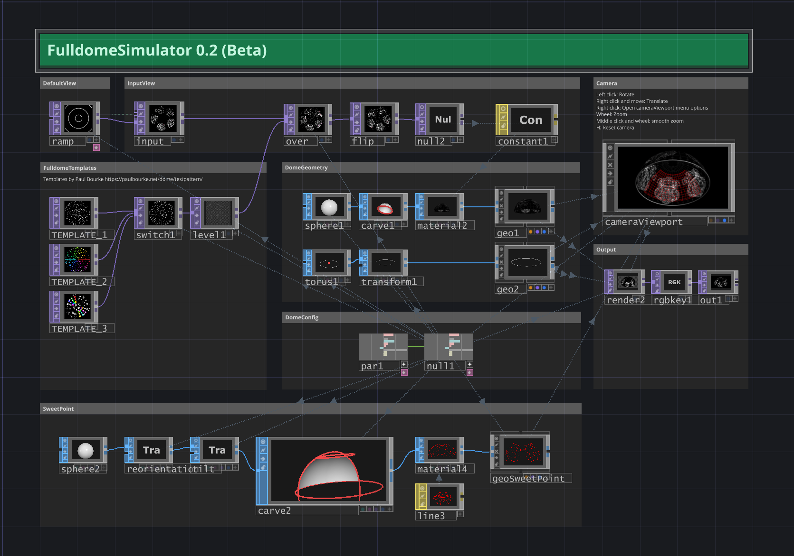
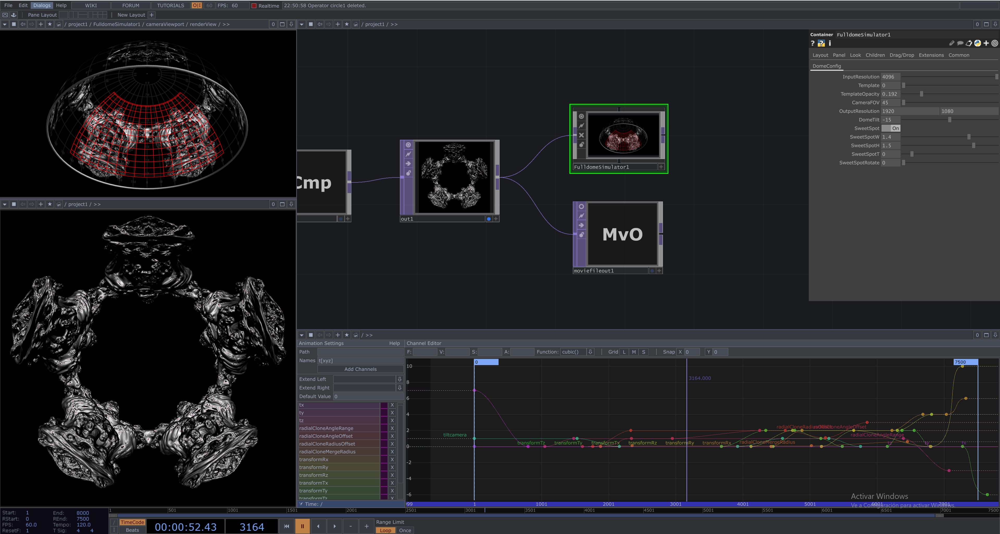

# TouchDesigner Fulldome Simulator (beta) v0.2
A lightweight TouchDesigner component (.tox) for simulating fulldome projections. It allows you to wrap any 2D or 3D visual onto a virtual dome and preview its corresponding deformation as it would appear in a real fulldome environment. This makes it possible to inspect fine details and better understand how visuals behave once projected across a dome surface.

This was developed as an initiative to test real-time visuals inside TouchDesigner before exporting, presented at the TouchDesigner Meetup STGO on October 28th at Planetario Huechuraba (Chile).

# Features

- Dome deformation preview – wrap 2D/3D visuals onto a virtual dome.
- 3 built-in templates – switch between different dome projection layouts.
- Configurable input – connect any TOP as the input source.
- Dome tilt – adjust the dome’s inclination to match real-world setups.
- Interactive camera – move inside the dome to explore from the spectator’s perspective.
- Sweet Spot grid – focus the viewer’s vision with a customizable grid overlay.

# Camera Controls

These controls allow you to step inside the dome and preview the deformation exactly from the spectator’s viewpoint.

- Left click → Rotate
- Right click + drag → Translate
- Right click → Open cameraViewport menu
- Mouse wheel → Zoom
- Middle click + wheel → Smooth zoom
- H → Reset camera

# How to Use

- Download the FulldomeSimulator.tox file and FulldomeTemplates folder from this repository.
- Open your TouchDesigner project.
- Drag and drop the .tox file into your network. Add FulldomeTemplates folders in the same level of your project.
- Connect your input TOP. Can be a 2D image, movie, or 3D render always as square. When using 3D rendering methods, it is essential to render with: Render Mode → **FishEye Equidistant (180°)**.
- Adjust the parameters in the DomeConfig panel to match your setup.
- Use the camera controls to explore the dome and check the deformation.
- Optionally export the output (use the node before the simulator) with Movie File Out node.

# Fulldome production and export recommendations:

In your timeline (bottom interface of TouchDesigner): Set the number of frames you need for your movie. Define the FPS (30 or 60) and set Range Limit: Once.

Use the Animation Component to control all changes on your timeline.

Use a Movie File Out node in image sequence mode with a defined FPS (matching the FPS in the timeline) and select the output folder for saving frames.

Hit REC on Movie File Out and wait your exportation!

## Use Cases

- Test and preview visuals before sending them to a fulldome environment.
- Understand how flat 2D images or 3D renders will deform when wrapped on a dome.
- Real-time prototyping for immersive installations, VJ sets, or planetarium content.

## Compatibility Note

This component was developed in TouchDesigner 2022, due to my license.
Behavior in later versions (e.g. 2023+) should be similar, but has not been fully tested.