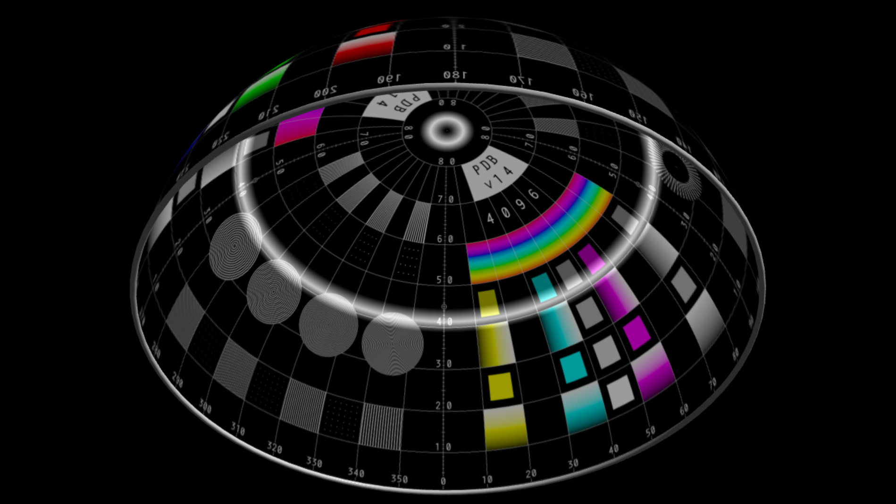

# TouchDesigner-Fulldome-Simulator
A lightweight TouchDesigner component (.tox) for simulating fulldome projections.
It allows you to wrap any 2D or 3D visual onto a virtual dome and preview its corresponding deformation as it would appear in a real fulldome environment.
This makes it possible to inspect fine details and better understand how visuals behave once projected across a dome surface.

✨ Features

- Dome deformation preview – wrap 2D/3D visuals onto a virtual dome.
- 3 built-in templates – switch between different dome projection layouts.
- Configurable input – connect any TOP as the input source.
- Dome tilt – adjust the dome’s inclination to match real-world setups.
- Interactive camera – move inside the dome to explore from the spectator’s perspective.
- Sweet Spot grid – focus the viewer’s vision with a customizable grid overlay.

🎮 Camera Controls
These controls allow you to step inside the dome and preview the deformation exactly from the spectator’s viewpoint.

- Left click → Rotate
- Right click + drag → Translate
- Right click → Open cameraViewport menu
- Mouse wheel → Zoom
- Middle click + wheel → Smooth zoom
- H → Reset camera

🔧 Use Cases

- Test and preview visuals before sending them to a fulldome environment.
- Understand how flat 2D images or 3D renders will deform when wrapped on a dome.
- Real-time prototyping for immersive installations, VJ sets, or planetarium content.

📌 Notes on 3D Rendering

When using 3D rendering methods, it is essential to render with:

- Render Mode → Fisheye Equidistant (180°)

🚀 How to Use

Download the FulldomeSimulator.tox file and FulldomeTemplates folder from this repository.
Open your TouchDesigner project.
Drag and drop the .tox file into your network.
Connect your input TOP (2D image, movie, or 3D render in fisheye mode).
Adjust the parameters in the DomeConfig panel to match your setup.
Use the camera controls to explore the dome and check the deformation.
Optionally export the output (node before the simulator) with Movie File Out node.

⚠️ Compatibility Note

This component was developed in TouchDesigner 2022, due to my license.
Behavior in later versions (e.g. 2023+) should be similar, but has not been fully tested.